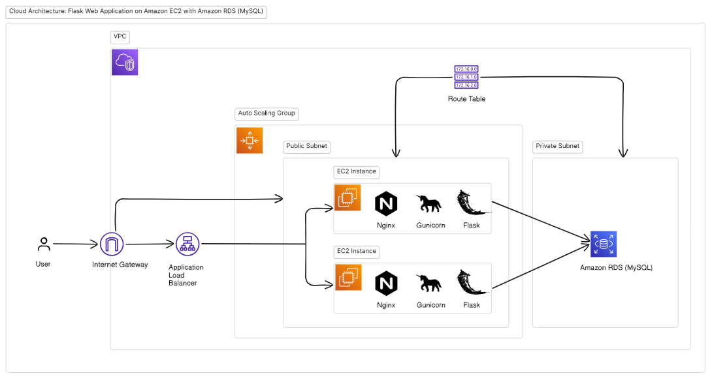

# AWS-Based Flask Web App Deployment

This project showcases the deployment of a **Flask web application with user login and registration functionality**, where user data is securely stored and retrieved from **Amazon RDS (MySQL)**. It follows a production-grade AWS architecture designed for high availability, scalability, and cost-efficiency within the AWS Free Tier.

---

## 🚀 Architecture Overview

- **Frontend**: HTML templates served by Flask
- **Backend**: Python Flask application
- **Database**: MySQL hosted on Amazon RDS
- **Compute**: EC2 instances (Auto Scaling)
- **Load Balancer**: Application Load Balancer (ALB)
- **Networking**: Custom VPC, public subnets, internet gateway, route tables, and security groups
- **Reverse Proxy**: Nginx
- **Service Management**: Gunicorn with systemd

---

## 🗂️ Cloud Architecture Diagram



---

## 🔧 Technologies Used

- Python
- Flask
- MySQL
- Gunicorn
- Nginx
- AWS EC2, RDS, ALB, Auto Scaling, VPC

---

## 🛠️ Features

- User Registration and Login
- Flask backend connected to AWS RDS (MySQL)
- Reverse proxy setup with Nginx
- Gunicorn used for WSGI server
- Auto Scaling group for dynamic instance management
- Load Balancer for distributing incoming traffic
- Systemd for auto-starting the Flask service on boot
- Infrastructure deployed under the AWS Free Tier

---

## 📂 Project Structure

```
/repo
├── script/                # EC2 instance setup script
│ └── ec2-userdata.sh
├── templates/             # HTML templates
│ ├── index.html
│ ├── login.html
│ └── register.html
├── .gitignore             # Git ignored files configuration
├── README.md              # Project documentation
├── app.py                 # Main Flask application
├── architecture.png       # Cloud architecture diagram
└── requirements.txt       # Python dependencies
```

---

## ⚙️ EC2 Instance Setup (via User Data Script)

- Installs Python, pip, Git, MySQL client, and Nginx
- Clones the GitHub repository and sets up a Python virtual environment
- Installs Python dependencies (`flask-mysqldb`, `gunicorn`, etc.)
- Configures Gunicorn and systemd to run the Flask app as a service
- Sets environment variables in the systemd service unit:
  - `FLASK_SECRET_KEY`
  - `MYSQL_HOST`, `MYSQL_USER`, `MYSQL_PASSWORD`, `MYSQL_DB`
- Configures Nginx as a reverse proxy to the Flask app running on port 5000
- Enables and starts the Flask service using `systemctl`

📄 See [ec2-userdata.sh](./script/ec2-userdata.sh) for the full setup script used to configure the EC2 instance.

---

## 🌐 Access

Once deployed, the application is accessible via the **ALB DNS name** (found in the AWS EC2 > Load Balancers section).

---

## 🔐 Security

- Environment variables for DB credentials and Flask secret key
- Security groups allow only necessary traffic (SSH, HTTP, DB)
- RDS configured with restricted access from EC2 instances only

---

## 📘 Documentation

- Deployment and architecture are documented using this README
- A detailed cloud architecture diagram is included in [`architecture.png`](./architecture.png).

---

## 🧪 Testing

- Functional testing done via browser (register/login)
- Failover tested by terminating EC2 instance (Auto Scaling spawns new one)
- Load testing handled by sending concurrent HTTP requests via ALB

---

## ✅ AWS Free Tier Compliance

All services used in this project were selected carefully to stay within AWS Free Tier limits:
- EC2: `t2.micro` instances
- RDS: `db.t4g.micro` (MySQL)
- Application Load Balancer and Auto Scaling: Usage kept within Free Tier boundaries

---